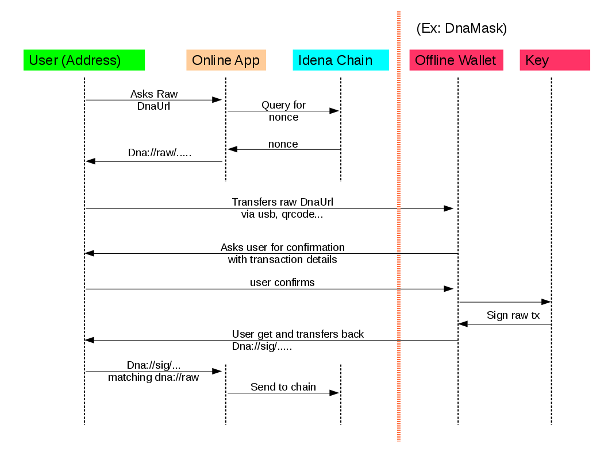

# Offline signing

This feature and workflow allow to keep a cold wallet on an airgapped machine, but still sign transactions in a safe way.  

That machine never is connected. transactions and signature can be transfered betwenn live app and cold wallet via usb key or qr codes for instance.

This was made possible with [Idena.Today](https://idena.today)'s team help and dnaurl protocol

## Example workflow

Here is a high level diagram on how this works.

DnaUrls are the glue that allow to safely transfer transaction core data and binary signature back and forth between the various apps.

  

DnaMask handles the cold / offline wallet side.

## Compatible online apps

In order to complete the workflow, an online app providing the raw DnaUrl then sending the Tx once signed via sig DnaUrl is required.

Existing js wallets would just need to use the dnaurl module to add that support.

We'll list the compatible apps there.
