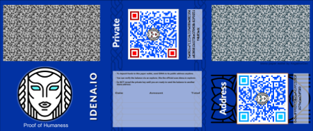
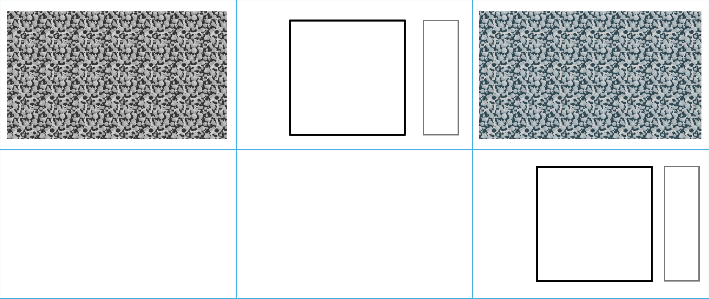
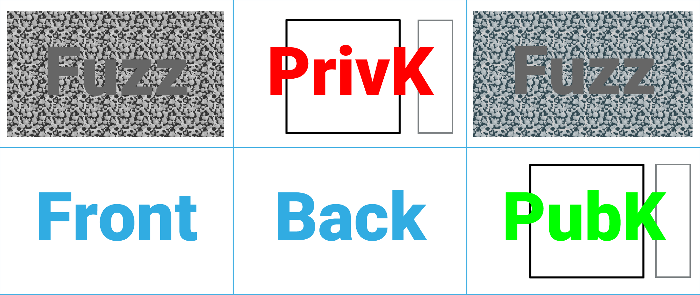

# Paper wallets

[https://angainordev.github.io/DnaMask/js/dist/paper.html](https://angainordev.github.io/DnaMask/js/dist/paper.html) makes paperwallets you can then print.

You can either use it online, or download the code and run it (open dist/index.html in your browser) on an airgapped computer, with no net access for extra safety.

## Templates

We plan to support several paperwallet form factors and templates.

## Paper Wallet Type 1

### How to fold the Paper Wallet Type 1 

TODO

### Custom templates

> You can create your own templates for this wallet, by using the following base (keep the same size and resolution):

Transparent outline  

Labeled template  

To submit your work, create a new directory under src/img/paper and place your image files there.  
The name of your variation is the directory name. The required files to produce are:

- wallet.png - 2067x874 px, optimized png. The background graphic
- thumb.png - 450 px width, optimized png. A thumbnail of a paper wallet
- front.png - 250 px width, optimized png. A thumbnail of the wallet front only
- optionally, a readme.md file with credits and contact info.   

> Make sure your work is royalty free and you have all rights on the graphic content you submit!

Then issue a PR. 
